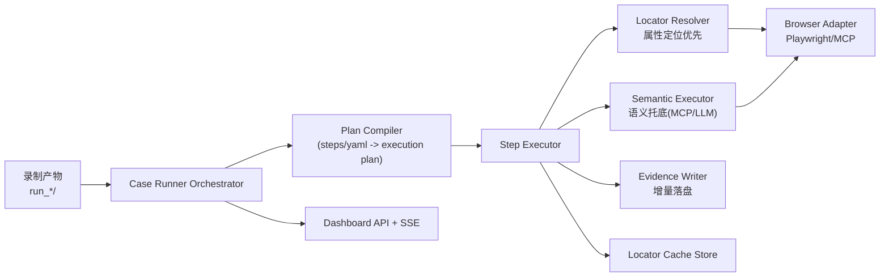
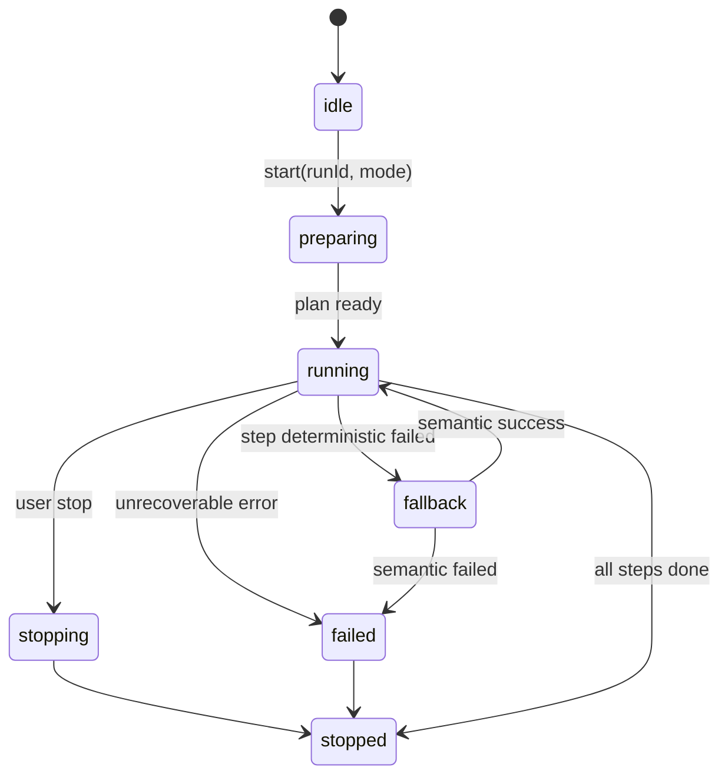

# 录制用例执行系统一体化文档（需求 + 架构 + 设计 + 详细设计）

版本：v1.0  
更新时间：2026-03-16  
适用范围：`ai_ui_recorder` 项目内“录制结果执行”能力建设  

---

## 1. 文档目标与范围

本文档是“将录制结果直接执行”的一体化设计文档，合并以下内容：

- 需求说明（Why / What）
- 架构设计（System Architecture）
- 概要设计（模块与流程）
- 详细设计（数据结构、API、状态机、伪代码、验收）

本次目标聚焦以下业务决策：

1. 支持将录制产物（`step_2_structured_steps.json` / `step_4_midscene_no_assert.yaml`）直接用于执行。
2. 首次可用时允许“全语义执行”（冷启动建档）。
3. 常规执行“属性定位优先”，失败时“语义托底”。
4. 执行过程自动沉淀定位资产（Locator Cache）并可手动全量刷新。

---

## 2. 业务背景与问题定义

当前系统已具备：

- 录制：生成 `actions/`、`snapshots/`、`meta.json`
- 翻译：生成结构化步骤与 Midscene YAML

当前缺口：

- 缺少统一“执行器（Runner）”模块，无法在项目内一键执行录制用例。
- 仅靠动态 uid/id 定位不稳定，UI 每次渲染会变化。
- 全部步骤都走大模型会导致成本高、耗时高、稳定性受模型波动影响。

核心挑战：

- 在“稳定执行、成本可控、对 UI 变化有韧性”三者之间取得平衡。

---

## 3. 需求定义

### 3.1 功能需求

FR-01 用例执行入口  
- 系统提供统一执行入口，支持指定 `runId` 启动执行。  
- 执行输入优先使用 `step_2_structured_steps.json`，可兼容 `step_4_midscene_no_assert.yaml`。

FR-02 两种执行模式  
- `semantic_full`：全语义执行（用于冷启动建档或人工全量刷新）。  
- `hybrid`：混合执行（属性定位优先，语义托底）。

FR-03 定位缓存资产  
- 执行时持续记录控件可定位信息，形成可复用缓存。  
- 下次执行优先命中缓存，减少模型调用次数。

FR-04 失败自愈  
- 属性定位失败后自动切换语义托底。  
- 语义成功后回写新定位信息，替换或降权旧定位。

FR-05 结果可追溯  
- 每步输出执行证据：开始时间、结束时间、耗时、定位方式、是否 fallback、错误信息。  
- 执行结果增量落盘，异常退出后可保留已完成步骤。

FR-06 Dashboard 管控  
- 提供启动执行、停止执行、查询状态、查看结果日志能力。  
- 执行过程可通过 SSE 实时推送。

### 3.2 非功能需求

NFR-01 稳定性  
- 目标：同一版本页面，混合执行成功率 >= 95%（无网络/环境异常前提）。

NFR-02 成本  
- 常规运行模型调用比例应显著低于全语义模式（目标 < 20% step 调用）。

NFR-03 性能  
- 单步执行默认超时可配置；流程支持超时重试和失败快速退出策略。

NFR-04 可维护性  
- 执行策略、阈值、重试次数集中配置，避免魔法数字分散在代码。

NFR-05 可观测性  
- 提供 `runner.log` + `run_result.json` + 失败截图（可选），支持定位问题。

---

## 4. 总体架构设计

## 4.1 架构总览



### 4.2 分层职责

1. Orchestrator（编排层）  
- 负责运行生命周期：start / stop / pause(预留) / status。  
- 管理状态机与并发保护（同一时刻仅一个 run 在执行）。

2. Compiler（计划生成层）  
- 将结构化步骤统一为内部执行计划 `ExecutionPlan`。  
- 标准化 action 类型，补齐默认参数。

3. Executor（执行层）  
- 逐步执行；每步先属性定位后语义托底。  
- 控制重试、超时、降级策略。

4. Locator Cache（资产层）  
- 存储每个 step 的候选定位器与置信度历史。  
- 支持版本化、失效、回写更新。

5. Evidence（证据层）  
- 增量写执行过程与结果。  
- 保证中断后仍可回放“执行到了哪里、为什么失败”。

6. API/UI（交互层）  
- Dashboard 触发执行并观察实时进度。

---

## 5. 概要设计

### 5.1 推荐执行策略

策略名称：`Hybrid Self-Healing Runner`

规则：

1. `sleep`、`keyPress` 等确定性动作直接执行，不调模型。
2. `click/input/assert` 先走属性定位（deterministic）。
3. 属性失败触发语义托底（MCP/LLM）。
4. 语义成功后写回缓存，用于后续同 step 命中。
5. 支持人工触发全语义重建缓存（页面大改版时）。

### 5.2 执行模式定义

- `semantic_full`  
  - 每个可交互 step 默认走语义执行；并收集定位资产。  
  - 用于首次建档、版本切换后重建。

- `hybrid`  
  - 优先属性定位；失败才语义。  
  - 用于日常低成本稳定运行。

### 5.3 输入优先级

1. `step_2_structured_steps.json`（主输入，字段稳定）  
2. `step_4_midscene_no_assert.yaml`（兼容输入）

说明：结构化步骤对执行器更友好，建议作为长期主输入。

---

## 6. 详细设计

### 6.1 目录与文件规划

建议新增模块目录：

```text
src/case_runner/
  index.js                 # 入口（函数方式）
  orchestrator.js          # 状态机与执行编排
  compiler.js              # 输入转换为 ExecutionPlan
  executor/
    step-executor.js       # 单步执行主逻辑
    deterministic.js       # 属性定位执行器
    semantic.js            # 语义执行器（MCP/LLM 适配）
  locator/
    resolver.js            # 定位解析策略
    cache-store.js         # 缓存读写与版本
    scorer.js              # 评分与降权
  adapters/
    browser-adapter.js     # 浏览器动作统一接口
    mcp-adapter.js         # MCP 调用封装
  output/
    evidence-writer.js     # 增量写结果
  model/
    types.js               # 数据结构定义
```

执行输出（建议落在每个 run 目录下）：

```text
output/run_xxx/
  execute/
    execute.plan.json
    execute.progress.json
    run_result.json
    runner.log
    failed_step_00N.png          # 可选
    locator_cache.snapshot.json
```

全局定位资产（跨 run）：

```text
output/locator_cache/
  locator-cache.v1.json
```

### 6.2 核心数据结构

#### 6.2.1 ExecutionPlan

```json
{
  "runId": "run_2026-03-11T06-18-24",
  "mode": "hybrid",
  "steps": [
    {
      "index": 1,
      "actionKind": "click",
      "description": "点击立即登录按钮",
      "target": "立即登录按钮",
      "inputText": "",
      "key": "",
      "assertText": "",
      "urlHint": "https://xxx/login",
      "timeoutMs": 10000,
      "retry": 1
    }
  ]
}
```

#### 6.2.2 LocatorAsset

```json
{
  "stepSignature": "click|立即登录按钮|/login|登录页",
  "pageFingerprint": {
    "urlPattern": "/login",
    "titlePattern": "登录"
  },
  "candidates": [
    {
      "type": "role",
      "value": { "role": "button", "name": "立即登录" },
      "score": 0.92,
      "successCount": 7,
      "failCount": 1,
      "lastSuccessAt": "2026-03-16T10:00:00Z"
    },
    {
      "type": "css",
      "value": "button.login-btn",
      "score": 0.56
    }
  ],
  "version": 3,
  "updatedAt": "2026-03-16T10:00:00Z"
}
```

#### 6.2.3 StepResult

```json
{
  "index": 1,
  "status": "passed",
  "strategy": "deterministic",
  "fallbackUsed": false,
  "startAt": "2026-03-16T10:01:01.001Z",
  "endAt": "2026-03-16T10:01:02.315Z",
  "durationMs": 1314,
  "error": "",
  "evidence": {
    "locatorType": "role",
    "locatorValue": "button[name='立即登录']"
  }
}
```

### 6.3 Step Signature 设计

`stepSignature` 用于跨运行关联“同一个业务步骤”，建议由下列字段拼接：

- `actionKind`
- `target`（或 description 的目标短语）
- `urlPattern`（URL 归一化后的路径级特征）
- `page`（结构化步骤页面名）

示例：

`click|立即登录按钮|/login|登录页`

注意：

- 不使用动态 uid/id 作为 signature 主键。
- uid/id 可作为候选定位特征之一，但默认低权重。

### 6.4 定位策略链（Resolver）

顺序建议：

1. role + name
2. aria-label / placeholder / name
3. 可见文本 + 附近上下文
4. 稳定 css（非动态类）
5. xpath（最后兜底）
6. 语义托底（MCP/LLM）

命中后必须执行校验：

- 元素可见、可交互（enabled）
- 文本或语义标签匹配预期
- 校验失败视同未命中，进入下一策略

### 6.5 自愈更新机制

规则建议：

1. 属性命中成功：对应候选 `score +1`（上限），`successCount +1`
2. 属性命中失败：`score -1`，`failCount +1`
3. 语义托底成功：写入新候选，初始中高分
4. 连续失败超过阈值：旧候选标记 `stale=true`

推荐默认阈值常量（集中配置）：

- `LOCATOR_MAX_RETRY = 2`
- `LOCATOR_STALE_FAIL_THRESHOLD = 3`
- `STEP_TIMEOUT_MS = 10000`
- `SEMANTIC_FALLBACK_TIMEOUT_MS = 15000`
- `CACHE_FLUSH_INTERVAL_STEPS = 1`（每步落盘，避免中断丢失）

### 6.6 执行状态机



状态说明：

- `preparing`：读取输入、编译计划、装载缓存
- `running`：正常执行步骤
- `fallback`：当前步骤进入语义托底
- `stopping`：收到停止信号，做安全收尾
- `stopped`：执行结束（成功/失败/中断）

### 6.7 API 设计（Dashboard）

建议新增接口：

1. `POST /api/case/run`
   - 请求：
     ```json
     {
       "runId": "run_2026-03-11T06-18-24",
       "mode": "hybrid",
       "source": "structured"
     }
     ```
   - 响应：任务已启动、执行实例ID

2. `POST /api/case/stop`
   - 请求：`{ "executionId": "exec_xxx" }`
   - 响应：已进入停止流程

3. `GET /api/case/status`
   - 响应：当前状态、当前 step、通过/失败统计、fallback 次数

4. `POST /api/case/rebuild-locator`
   - 语义全量重建入口（等价于 `semantic_full` 模式）

SSE 日志扩展字段：

- `phase`：prepare / step / fallback / finish
- `stepIndex`
- `strategy`
- `durationMs`

### 6.8 入口函数设计（避免命令行参数强耦合）

遵循“函数参数作为主入口”：

- `runCaseExecution({ runId, mode, source })`
- `stopCaseExecution(executionId)`

可保留命令行包装层，但仅做薄适配，不承载核心逻辑。

### 6.9 关键流程伪代码

```js
async function executePlan(plan, context) {
  for (const step of plan.steps) {
    const start = now();
    let result = await tryDeterministic(step, context);
    if (!result.ok) {
      result = await trySemanticFallback(step, context);
    }
    await writeStepResult(result);
    await updateLocatorCache(step, result);
    if (!result.ok && context.failFast) break;
  }
  await finalizeRunResult();
}
```

### 6.10 容错与恢复策略

1. 增量写盘  
- 每个 step 结束后写 `execute.progress.json` 与 `run_result.json`。

2. 异常恢复  
- Runner 重启后可读取 progress，从下一步继续（可配置）。

3. 停止策略  
- 用户 stop 后不再启动新 step，等待当前 step 安全退出。

4. 失败快照  
- 关键失败点保存截图与页面摘要，便于排障。

### 6.11 日志规范

建议日志级别：

- `INFO`：步骤开始/结束、命中策略
- `WARN`：属性失败切换语义、候选降权
- `ERROR`：步骤最终失败、执行中断

日志字段标准化：

- `executionId`
- `runId`
- `stepIndex`
- `strategy`
- `elapsedMs`
- `errorCode`
- `message`

---

## 7. 安全与边界

1. 路径安全  
- 所有 run 目录访问需做路径穿越防护。

2. 执行隔离  
- 同时仅允许一个 active execution（后续可扩展队列）。

3. 敏感信息  
- 输入类步骤对密码等字段继续脱敏，不写明文到日志和缓存。

4. 人机边界  
- 语义托底只在属性失败时启用，避免不必要大模型暴露面。

---

## 8. 测试与验收标准

### 8.1 功能验收

- AC-01 指定 `runId` 可成功启动执行并完成。
- AC-02 `hybrid` 模式下至少存在 deterministic 命中步骤。
- AC-03 属性失败时可自动触发语义托底并继续执行。
- AC-04 语义成功后缓存更新，下次同 step 优先命中属性。
- AC-05 可人工触发全语义重建缓存。

### 8.2 性能与成本验收

- AC-06 与 `semantic_full` 对比，`hybrid` 模式模型调用比例显著下降。  
- AC-07 常规 100 step 回放中，`run_result.json` 完整记录每步策略与耗时。

### 8.3 稳定性验收

- AC-08 页面小改动（文案微调、局部结构变化）时，整体通过率仍满足目标。  
- AC-09 执行中断后，过程文件可用于复盘失败位置与原因。

---

## 9. 迭代计划建议

### 阶段 P0（最小可用）

1. 新建 Runner 主流程（仅支持结构化步骤输入）
2. 支持 `sleep/keyPress/click/input` 基础动作
3. 支持 `hybrid` 与 `semantic_full`
4. 结果与日志落盘

### 阶段 P1（可运营）

1. 接入 Dashboard API + SSE
2. 完成 Locator Cache 评分与失效管理
3. 失败快照与执行报告增强

### 阶段 P2（可规模化）

1. 支持断点续跑与批量调度
2. 引入跨页面版本策略（按页面指纹分桶缓存）
3. 统计看板：命中率、fallback 比例、失败热点步骤

---

## 10. 配置项建议清单

建议在配置模块统一新增：

- `CASE_RUNNER_DEFAULT_MODE = "hybrid"`
- `CASE_RUNNER_STEP_TIMEOUT_MS = 10000`
- `CASE_RUNNER_STEP_RETRY_COUNT = 1`
- `CASE_RUNNER_FAIL_FAST = false`
- `CASE_RUNNER_ENABLE_SCREENSHOT_ON_FAIL = true`
- `LOCATOR_CACHE_FILE = "./output/locator_cache/locator-cache.v1.json"`
- `LOCATOR_STALE_FAIL_THRESHOLD = 3`
- `SEMANTIC_FALLBACK_ENABLED = true`
- `SEMANTIC_FALLBACK_TIMEOUT_MS = 15000`

---

## 11. 风险与对策

风险 R1：页面大改后缓存整体失效  
- 对策：提供“一键全语义重建”并支持版本化缓存。

风险 R2：语义托底成本上升  
- 对策：严格限制触发条件，优先 deterministic，增加缓存命中率指标。

风险 R3：误定位导致误操作  
- 对策：执行前校验 + 关键动作二次确认（可配置）。

风险 R4：长流程中断导致信息丢失  
- 对策：每步增量落盘，日志结构化，支持恢复。

---

## 12. 结论

该方案不走“纯 Selenium 手工定位”也不走“每步都调模型”，而是采用：

- 首次全语义建档
- 日常属性优先执行
- 失败语义托底自愈
- 人工全量刷新重建

它能够在稳定性、成本、可维护性之间取得工程上最优平衡，且与当前项目现有录制与翻译产物天然衔接。

---

designed by @yuzechao

