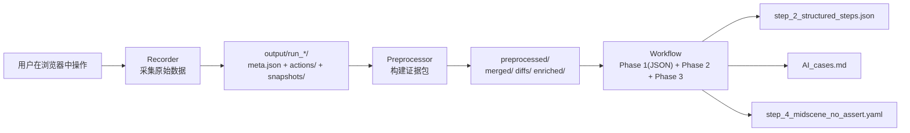

# 设计文档（总设·收敛版）— AI UI Recorder（v2.1）

版本：v2.1（总设收敛版）  
更新时间：2026-03-24  

> 本文档是系统级总设计，但按“新的思路”做了**收敛**：只保留系统级关键决策、数据契约、排障路径；把翻译细节与算法细节下沉到 `doc/translate_design.md` 与代码注释。  
> 需求与验收请看：`doc/requirements.md`；部署与运行请看：`doc/user_manual.md`。

---

## 1. 一页概览（你需要记住的 6 件事）

1. 系统定位：**Evidence-Driven** —— 先把“发生了什么”变成证据链，再让 AI 归纳为用例。
2. 录制只做“稳定采集”：**物理动作 + 整页 AX 快照 + 精确表单状态**，不在录制阶段做推理。
3. 快照模型：**完美快照模型 v2**（轮询缓存 + 混合策略保存）保证 pre “干净”、post “完整”。
4. 数据契约：**N 个操作 → N+1 个快照**，相邻操作共享中间快照（零冗余，强可调试）。
5. 翻译：**预处理构建证据包** → AI 两阶段（逐条分析可恢复 → 归纳用例）。
6. Dashboard：把录制/翻译/日志/文件查阅放到 Web UI，尽量不依赖命令行。

---

## 2. 设计原则（Why）

### 2.1 证据优先（Evidence > Guess）

LLM 的最大风险不是“不会写表格”，而是“会猜”。因此系统在架构上强制：

- **先把证据算出来**（diff、表单增量、上下文片段、分类 hints）
- 再要求 AI 只基于证据写结论
- 信息不足必须明确写“信息不足”，禁止从 selector/class 反推业务含义

### 2.2 稳定采集 / 可变理解

- **录制阶段**：目标是稳定、可复现、可追溯 → 只采集原始数据。
- **翻译阶段**：目标是可迭代提升质量 → 允许频繁调整预处理与 Prompt。

### 2.3 文件系统解耦 + 过程文件落盘

录制与翻译通过 `output/run_*/` 目录交互：

- 同一份录制数据可反复翻译/调参，无需重录
- 中间产物落盘，按证据链定位问题：actions → snapshots → diffs/enriched → AI_steps → AI_cases

---

## 3. 端到端架构与数据流（How）

### 3.1 分层架构



### 3.2 模块边界（系统级）

| 模块 | 目录 | 负责 | 不负责 |
|---|---|---|---|
| 录制器 | `src/recorder/` | 浏览器生命周期、物理动作捕获、快照轮询、分文件存储、meta 摘要 | diff/上下文/分类/AI 调用 |
| 翻译入口 | `src/case_translate/index.js` | 定位 meta、串联预处理与工作流 | 具体算法细节 |
| 预处理器 | `src/case_translate/preprocessor/` | 语义归并、diff、上下文、表单增量、分类、噪声标记、落盘 | AI 调用 |
| Prompt 模板 | `src/case_translate/prompts/` | Prompt 文本与输出约束 | 数据计算 |
| 工作流 | `src/case_translate/workflow.js` | Phase 1(JSON)/Phase 2/Phase 3 编排、异常兜底、增量保存、上下文窗口 | 预处理实现 |
| Selenium 导出 | `src/selenium_export/` | 录制增量写 `step_0_selenium_draft.py`；Phase1 后按 `step_2` + `enriched/` 生成 `step_0_selenium_from_recording.py`；**仅 XPath + `Driver4`** | 替代 Playwright 回放；不扩展 Tab 专项 merge |
| Dashboard | `src/dashboard/` | 录制/翻译控制、SSE 日志、文件浏览 | 核心算法（复用上述模块） |

> 翻译子系统的详细设计（含 enrichedAction 结构、预处理算法、Prompt 规则、工作流细节）统一放在 `doc/translate_design.md`。

---

## 4. 数据契约（系统可调试性的根基）

### 4.1 输出目录结构（每次 run 一个目录）

```
output/
  run_2026-02-15T06-08-43/
    meta.json
    recorder.log
    snapshots/
      snapshot_000.txt
      snapshot_001.txt
      ...
    actions/
      action_001.json
      action_002.json
      ...
    preprocessed/
      merged/merge_report.json
      diffs/diff_001.txt ...
      enriched/enriched_001.json ...
    step_2_structured_steps.json
    step_2_structured_steps.errors.json
    AI_cases.md
    step_4_midscene_no_assert.yaml
    generate.log
    step_0_selenium_draft.py              # 可选：SELENIUM_EXPORT_ENABLED 且录制时增量生成（草稿，无 merge 输入）
    step_0_selenium_from_recording.py     # 可选：同上开关且翻译 Phase1 完成后生成（终稿，enriched）
```

### 4.2 关键命名约定（必须一致）

设总操作数为 \(N\)：

- 快照数为 \(N+1\)
- `action_N`: pre = `snapshot_{N-1}`，post = `snapshot_{N}`
- `diff_N`: `snapshot_{N-1} → snapshot_{N}`
- 零冗余：`post(N) === pre(N+1)`

### 4.3 核心数据对象（概览）

- **action（原始）**：物理动作 + 轻量 element（**主定位字段为 `element.xpath`**，与 `formStateDelta` 的键一致）+ `formStateDelta` + `url/title/timestamp`
- **snapshot（原始）**：整页 AX Tree（裁剪后）转为 YAML 风格文本
- **meta.json**：一次 run 的索引与摘要（总数、时间、URL、actionSummary 等）
- **enrichedAction（证据包）**：翻译阶段生成，包含 diff/上下文/表单增量/分类/语义归并结果等

> enrichedAction 的完整字段定义与生成流程见 `doc/translate_design.md`。

---

## 5. 录制子系统（Recorder）关键设计

### 5.1 录制什么：只录“物理动作”

录制阶段把“可录制操作”定义为物理动作：

- 鼠标：`click`、`dblclick`、`contextmenu`
- 键盘：设计目标含 `Enter / Tab / Escape / Space`；**当前实现**仅将 **Enter** 记为独立 `keypress` action（见 `src/recorder/inject-script.js`）

输入/勾选/选择等“值变化”不靠监听逐字事件，而靠证据链在翻译阶段推导（diff + formStateDelta）。

### 5.2 完美快照模型 v2（核心）

目标：对每个 action 都得到稳定的 pre/post 快照，使其回答：

- 操作前页面是什么样？
- 操作后页面变成什么样？（包含“渐进行为”）

关键做法：

- **后台轮询**：每 `SNAPSHOT_POLL_INTERVAL_MS` 轮询一次整页 AX 快照，缓存到内存
- **混合策略保存**：
  - `start()` 保存 `snapshot_000` 作为初始态
  - 第 1 个 action 到达：只写 action，不保存快照（它的 pre=000）
  - 从第 2 个 action 开始：action 到达时，把“上一段间隙结算后的缓存快照”保存为 `snapshot_{N-1}`（=post(前一条)=pre(当前条)）
  - `stop()` 补保存终态 `snapshot_N`

该策略在工程上同时保证：

- **pre 干净**：快照来自轮询缓存，不在 handler 内 await snapshot
- **post 完整**：用户打字/异步渲染等变化落在“下一次动作到来”之前的缓存快照中

### 5.3 `formStateDelta`：精确表单证据（与 AX 快照互补）

轮询快照有时间粒度，且 AX 对部分控件 value 的反映不稳定，因此：

- 页面端在 `pointerdown/keydown capture` 阶段同步采集表单状态，作为 `formStateDelta`
- 不与快照强行合并，保持“证据来源分离”

### 5.4 多 Tab 支持（当前实现）

- 事件捕获脚本在 **Context 级注入**，新 Tab 打开后可自动生效
- action 自带 `url/title` 区分页面

### 5.4.1 导航后补注入（主 frame + 子 iframe）

- 主框架发生 `framenavigated` 后，等待 `RECORDER_POST_NAV_INJECT_CHECK_DELAY_MS` 再检测 `window.__recorderInjected`，减少 SPA 尚未就绪时的误判。
- 若判定脚本丢失，则遍历 `page.frames()`，对**尚未注入**的同源可访问 frame 执行 `evaluate(injectedScript)`，避免仅在主文档补注入、而用户实际操作发生在 iframe 内时 `totalActions=0`。

### 5.4.2 Electron EXE 录制模式

- 在 `Recorder` 中新增 Electron 启动分支：`startElectron(executablePath, electronArgs)`。
- 启动方式采用 Playwright Electron API（`_electron.launch`），并复用现有：
  - Context 级注入脚本
  - action 回传与分文件存储
  - 快照轮询与 `N action -> N+1 snapshot` 契约
- 通过 `src/recorder/electron-cli.js` 提供命令行入口，EXE 路径由用户显式传入。

### 5.5 停止方式

- 主方式：关闭浏览器窗口触发收尾流程
- 备用方式：Ctrl+C（通过禁用 Playwright 默认信号处理避免终态快照竞态）

### 5.6 浏览器视口策略（防止底部内容被裁切）

- 默认启用 `USE_NATIVE_WINDOW_VIEWPORT=true`：
  - 通过 `context.viewport=null` 使用浏览器真实可视区高度
  - 启动参数附加 `--start-maximized`，并通过 CDP 显式执行窗口最大化确保稳定生效
  - 该模式可避免“显示器分辨率=viewport 高度 + 浏览器导航栏高度”导致的底部不可见问题
- 若需要完全固定渲染尺寸，可切换 `USE_NATIVE_WINDOW_VIEWPORT=false`，并使用 `VIEWPORT_WIDTH/VIEWPORT_HEIGHT`

---

## 6. 翻译子系统（case_translate）关键设计

翻译子系统详细说明见 `doc/translate_design.md`。总设只保留系统级结论：

### 6.1 预处理器的价值

不要让 LLM 自己对比两份大文本快照。应先把证据算出来：

- diff（变化点）
- 表单增量（输入了什么）
- 上下文片段（变化发生在 UI 哪个区域）
- 分类 hints（告诉模型应该看哪里）
- 语义归并（click→input、双击去重、噪声过滤）

### 6.2 三阶段工作流（最终形态）

- **Phase 1**：逐条生成结构化步骤（JSON）→ `step_2_structured_steps.json`
  - 模型输出非严格 JSON 时，执行修复与兜底，不阻塞流程
  - 每条步骤携带 `intervalFromPreviousMs`（相邻步骤完成间隔）
- **Phase 2**：有效步骤瘦身后按固定窗口（默认 20 步）多次归纳，每窗 1 个 Case，合并为 `AI_cases.md`
- **Phase 3**：基于结构化步骤生成 Midscene（默认不写 assert）→ `step_4_midscene_no_assert.yaml`
  - 转换时可按 `intervalFromPreviousMs` 自动插入 `sleep`，表达上一步操作后的产品响应时长

### 6.2.1 独立翻译启动器（standalone）

- 新增 `src/case_translate/standalone-cli.js` 作为独立翻译入口：
  - 运行目录定位：EXE 场景取 `process.execPath` 所在目录，Node 场景取 `process.cwd()`
  - 默认目标目录：`<launcherDir>/output/` 下最新 `run_*`
  - 可选目录参数：命令行第一个参数指定 `run_*` 目录名
  - AI 配置来源：读取 `<launcherDir>/ai.local.json` 并注入环境变量，复用现有 ai-config 校验逻辑

### 6.3 三个“调参旋钮”（质量/成本/速度平衡）

- `SNAPSHOT_MAX_DEPTH`：快照信息量
- `DIFF_TRUNCATE_THRESHOLD`：diff 输入体积
- `EVIDENCE_CONTEXT_WINDOW_SIZE`：Phase 1 连续性上下文长度

---

## 7. Dashboard 关键设计

Dashboard 的目标：不依赖命令行也能完成全流程：

- 录制开始/停止
- AI 翻译启动
- SSE 实时日志
- run 历史与文件浏览

服务端接口与安全边界（路径穿越防护等）以代码注释为准：`src/dashboard/server.js`。

---

## 8. 试用中转工具设计（Go 独立模块）

试用场景下，很多目标用户没有可用模型，因此增加独立工具：

- 目录：`tool/ai-proxy-go`
- 目标：让主工程只改 `baseUrl/apiKey` 即可使用试用模型，不改业务代码
- 启停：可独立开关，不影响主工程录制链路

### 8.1 接口与职责

- `POST /v1/chat/completions`
  - 对外 OpenAI 兼容接口（供主工程调用）
  - 服务端注入上游 API key，客户端只持有 trial key
- `POST /api/chat`
  - 前端验证页专用简化接口，固定走流式回复
- `GET /`
  - 返回内嵌验证页面
- `GET /health`
  - 健康检查与运行状态

### 8.2 管控策略

- **总开关**：`enabled=false` 时统一拒绝
- **鉴权**：trial key 白名单校验
- **限流**：按 `key + IP` 的分钟固定窗口限流

### 8.3 与主工程衔接

主工程无需改调用代码，保持 `src/utils/ai-config.js` + `src/case_translate/ai-client.js` 现有逻辑；只需把 `config/ai.local.json` 的 `baseUrl` 指向中转地址（如 `http://127.0.0.1:8787/v1`）。

---

## 9. 运行与排障（强烈建议按证据链自底向上）

### 8.1 运行入口（Windows / PowerShell）

```powershell
npm run dashboard
npm run record
npm run translate
```

### 8.2 排障顺序

1. **录制是否有数据**：`meta.json` 的 `totalActions`，以及 `actions/`
2. **快照是否完整**：`snapshots/` 是否满足 \(N+1\) 条
3. **证据是否正确**：`preprocessed/diffs/`、`preprocessed/enriched/`
4. **Phase 1 是否合理**：`step_2_structured_steps.json` 的 `basis` 是否引用了正确证据
5. **Phase 2 是否合理**：`AI_cases.md` 是否按业务意图正确分组
6. **日志定位**：`recorder.log`、`generate.log`、`preprocess.log`

---

## 10. 已知限制与路线图（系统级）

- 被动变化检测（等待期间 UI 变化）：下一阶段实现（避免“变化归属到下一次动作”）
- hover / drag：下一阶段按需实现
- AX 语义依赖 ARIA 标注：证据不足时系统必须保守输出

---

## 附录：关键代码索引

- 录制核心：`src/recorder/recorder.js`
- 注入脚本：`src/recorder/inject-script.js`
- 快照裁剪与格式化：`src/recorder/snapshot-utils.js`
- 翻译入口：`src/case_translate/index.js`
- 预处理入口：`src/case_translate/preprocessor/index.js`
- 工作流：`src/case_translate/workflow.js`
- Prompt：`src/case_translate/prompts/step-analysis.js`、`src/case_translate/prompts/case-generation.js`
- Dashboard：`src/dashboard/server.js`、`src/dashboard/static/index.html`
- Go 中转：`tool/ai-proxy-go/cmd/server/main.go`、`tool/ai-proxy-go/internal/http/server.go`

---

## 附录：路线图与补充设计文档

- **路线图 / 待办清单**：`doc/todo_list.md`
- **补充设计：快照时机（方案演进与取舍）**：`doc/snapshot_timing_design.md`

