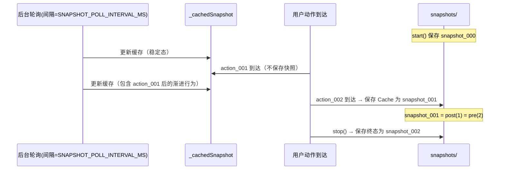

# 快照时机设计（方案演进与取舍）— AI UI Recorder

更新时间：2026-02-17  

> 本文档用于解释：**我们到底在什么时机拍快照**、有哪些备选方案、各自的优缺点，以及为什么最终选择当前实现的“完美快照模型 v2”。  
> 本文是 `doc/design.md` 的补充设计文档；实现以 `src/recorder/recorder.js` 为准。

---

## 1. 问题定义：我们要解决的不是“拍到快照”，而是“拍对快照”

对每条用户动作（action），系统要回答两个问题：

- **preSnapshot**：用户做这个动作之前，看到了什么页面状态？
- **postSnapshot**：这个动作完成后（包含渐进行为），页面最终变成了什么状态？

难点在于：浏览器 UI 的变化包含**同步变化**与**渐进行为**（打字、异步加载、动画结算），而 `page.accessibility.snapshot()` 本身又是异步调用，存在竞态。

---

## 2. 关键约定：间隙归属原则（决定了 postSnapshot 的“边界”）

我们采用的约定是：

> 两个相邻用户动作之间发生的一切变化（用户继续打字、异步渲染、动画结算等），**归属于前一个动作**。

推论：

> `post(N) === pre(N+1)`（同一张“稳定态”快照同时是前一条的 post 和后一条的 pre）

这样做的价值：

- **叙事一致**：用户下一步操作通常依赖“看到了上一步结果”，因此“下一次用户动作到来”天然是“上一段变化已基本结算”的代理信号。
- **零冗余**：N 个 action 只需要 N+1 张快照（共享中间快照）。

---

## 3. 候选方案对比（为什么没选其它方案）

下面把“拍摄时机”的思路按演进顺序列出来。你可以把它理解为：我们逐步把竞态、渐进行为归属、成本与可解释性问题都解决掉。

### 方案 A：在 action handler 内现拍现用（朴素 pre/post）

**做法**：

- action 到来时：`await snapshot()` 作为 `pre`
- action 处理后：`await snapshot()` 作为 `post`

**优点**：

- 概念简单：每条 action 明确拍两张

**致命缺点**：

- **pre 不干净**：`snapshot()` 异步执行期间，页面可能已经因当前 action 的同步效果发生变化（例如 toggle 已翻转），导致 pre 其实是“操作后”。
- **post 不完整**：渐进行为（打字/异步加载）往往还没发生或没结算完，post 过早。
- **成本高**：每条动作 2 次 snapshot，耗时与体积都明显变大。

结论：不可用（会系统性错归因）。

### 方案 B：固定延迟拍 post（例如 300ms/1s）

**做法**：

- action 到来时：拍 pre
- `setTimeout(delay)` 后拍 post

**优点**：

- 能覆盖部分异步渲染（比方案 A 好一点）

**缺点**：

- **拍脑袋延迟**：不同页面/操作响应时间差异巨大，固定延迟无法同时满足：
  - 快速操作（浪费时间）
  - 慢响应/跳转（拍到中间态）
  - 连续操作（竞态叠加）
- **仍然难保证 pre 干净**：pre 仍可能被同步变化污染（因为 snapshot 异步）。

结论：工程上不稳定，排障困难。

### 方案 C：每次 action 到来时拍 1 张快照，并用“下一次 action 的快照”当 post

**做法（核心思想正确，但实现仍有坑）**：

- action 到来时拍一张快照 `S_k`
- 令 `pre(action_k)=S_{k-1}`，`post(action_k)=S_k`

这已经符合“间隙归属原则”，也自然满足 `post(N)=pre(N+1)`。

**优点**：

- 归属正确：渐进行为自然落入下一次用户动作之前
- 零冗余：N action → N+1 snapshot

**关键缺点**：

- **pre 仍可能不干净**：因为拍快照仍在 action handler 内异步发生，当前 action 的同步变化可能已污染了“当前拍到的快照”，进而污染上一条 action 的 post / 下一条 action 的 pre。

结论：方向正确，但需要从“拍摄”层面解决竞态。

### 方案 D（最终选择）：周期轮询拍摄 + 混合策略保存（完美快照模型 v2）

这就是当前实现采用的方案（见 `src/recorder/recorder.js` 的注释与实现）。

**核心思想**：把“拍摄快照”与“保存快照”解耦。

#### D1. 周期轮询拍摄（解决 pre 不干净）

- Node.js 后台每 `SNAPSHOT_POLL_INTERVAL_MS` 轮询一次 `page.accessibility.snapshot()`
- 把最新快照缓存为 `_cachedSnapshot`
- action 到来时**不在 handler 内 await snapshot** 来当 pre，而是直接用缓存值作为证据来源

这避免了“在 click handler 里 await snapshot 导致同步变化污染”的竞态来源。

#### D2. 混合策略保存（解决 post 不完整 + 保持零冗余）

保存策略（与 `N action → N+1 snapshot` 对齐）：

- `start()`：保存 `snapshot_000`（初始态）
- 第 1 个 action 到达：只写 `action_001.json`，**不保存快照**（它的 pre=000）
- 从第 2 个 action 开始：每次 action 到达时，把“上一段间隙结算后的缓存快照”保存为 `snapshot_{N-1}`
  - 该快照同时是 `post(前一条)` 与 `pre(当前条)`
- `stop()`：补保存终态 `snapshot_N`（最后一个 action 的 post）

用序列图表示：

**最终收益**：

- **pre 干净**：避免 handler 内 await snapshot 的污染
- **post 完整**：渐进行为自然累积到下一次动作到来前的缓存
- **零冗余**：严格满足 N action → N+1 snapshot
- **可解释/可排障**：任何 action 都能定位到 `snapshot_{i-1}`、`snapshot_i`、`diff_i`

---

## 4. `formStateDelta`：补齐“轮询快照的时间粒度”与“表单值不稳定映射”

即使快照时机正确，轮询依然有天然限制：

- 轮询是离散采样（例如 300ms），表单输入可能在两次采样间发生
- AX Tree 对某些控件 value/state 的呈现不完全稳定

因此当前实现额外做了一个关键设计：

- 在浏览器端注入脚本的 `pointerdown/keydown capture` 阶段**同步**采集表单状态
- 以 `formStateDelta` 随 action 一起落盘（`actions/action_NNN.json`）

在翻译阶段：

- 通过相邻 action 的 `formStateDelta` 计算增量（`formStateChangeText`）
- 用来做语义归并（click 输入框 → input + inputValue）

---

## 5. 与当前代码的对应关系（索引）

- 录制器核心（轮询 + 混合保存）：`src/recorder/recorder.js`
- 注入脚本（formStateDelta 同步采集）：`src/recorder/inject-script.js`
- 快照裁剪与文本化：`src/recorder/snapshot-utils.js`

