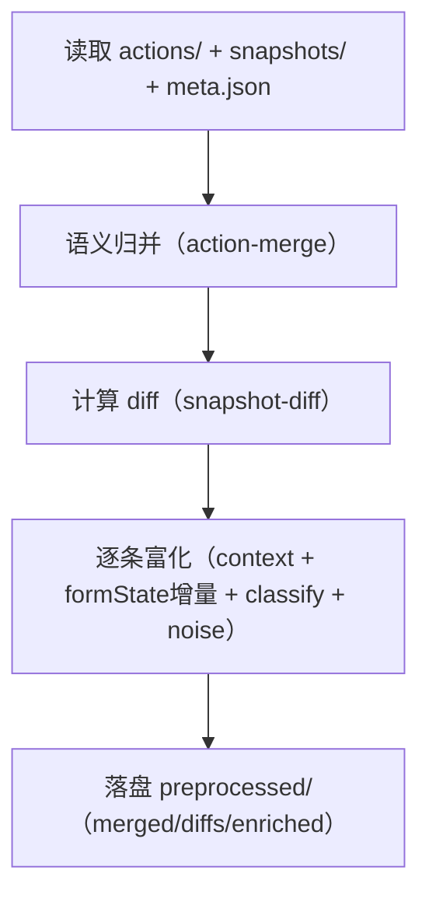
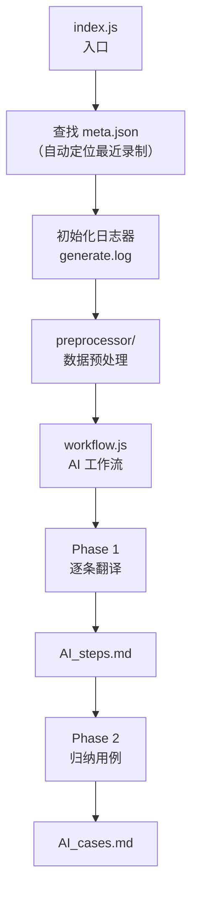
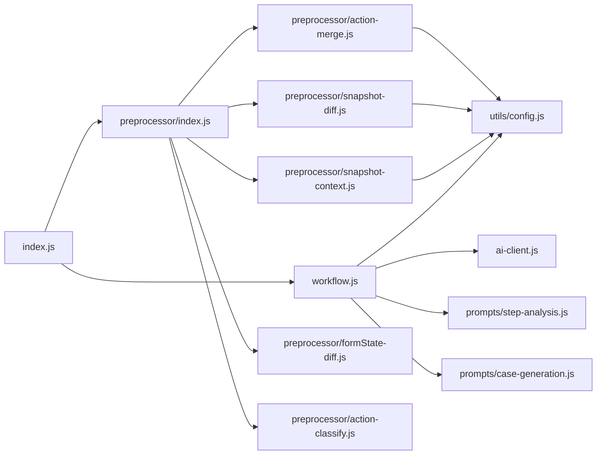
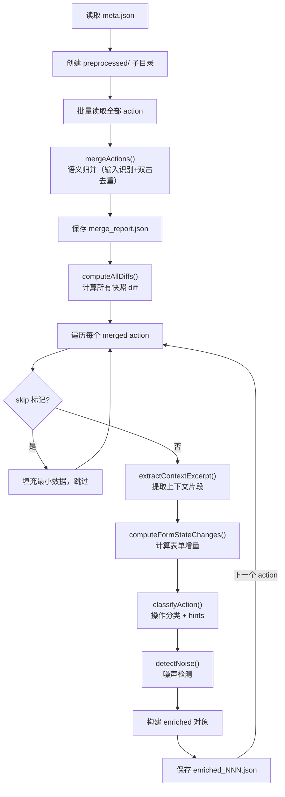
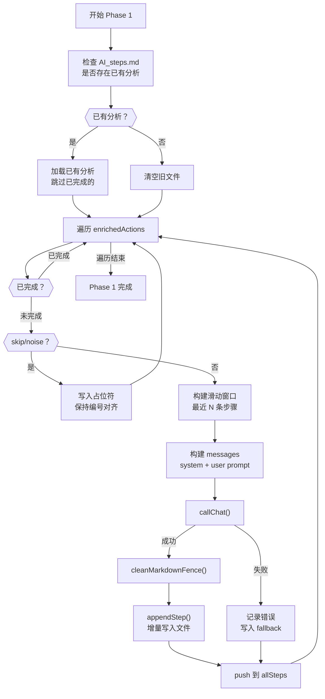
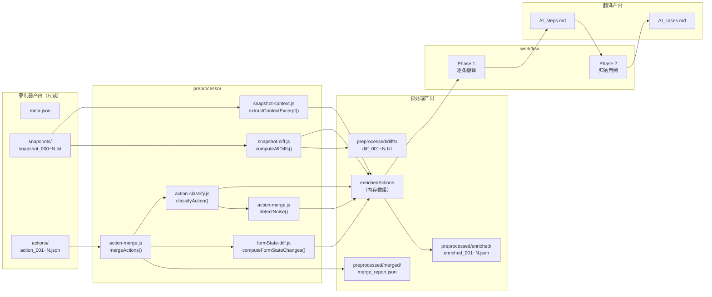

# 翻译子系统设计文档（重写）— `case_translate`（v2.1）

版本：v2.1（文档重写版）  
更新时间：2026-02-17  

> 本文档聚焦翻译子系统：如何把 Recorder 的原始数据（actions + snapshots + meta）转换为**证据驱动**的 `AI_steps.md` / `AI_cases.md`。  
> 系统总览请看：`doc/design.md`；需求与验收请看：`doc/requirements.md`；运行方式请看：`doc/user_manual.md`。

---

## 1. 模块定位与边界

### 1.1 定位

`case_translate` 是 AI UI Recorder 的**数据消费者**：

- 输入：`output/run_*/` 下 Recorder 的原始产物（只读）
- 输出：预处理产物 + AI 翻译产物（可反复生成）

### 1.2 设计边界（必须坚持）

- **与录制模块完全解耦**：只通过文件系统交互，不直接依赖 Recorder 内部状态。
- **先证据后结论**：预处理负责把证据算出来（diff/表单增量/上下文/分类），Prompt 负责强约束“禁止猜测”。
- **可恢复、可追溯**：Phase 1 增量写盘 + 中断恢复；所有关键中间产物落盘，便于定位问题。

---

## 2. 输入 / 输出契约（Data Contract）

### 2.1 输入（Recorder 产物）

位于某个 `runDir = output/run_<timestamp>/`：

- `meta.json`
- `snapshots/snapshot_000.txt ... snapshot_NNN.txt`
- `actions/action_001.json ... action_NNN.json`

关键命名约定（系统级约定，翻译模块必须遵守）：

- `action_N`: `preSnapshot = snapshot_{N-1}`，`postSnapshot = snapshot_{N}`
- `diff_N`: `snapshot_{N-1} → snapshot_{N}`
- `N` 个 action 对应 `N+1` 个 snapshot（零冗余）

### 2.2 输出（翻译模块产物）

位于同一 `runDir`：

- `preprocessed/merged/merge_report.json`
- `preprocessed/diffs/diff_NNN.txt`
- `preprocessed/enriched/enriched_NNN.json`
- `AI_steps.md`（Phase 1：逐条步骤分析，可恢复）
- `AI_cases.md`（Phase 2：归纳用例表格）
- `generate.log`、`preprocess.log`

---

## 3. 目录结构与模块职责

```
src/case_translate/
  index.js                 # 入口：定位 meta → preprocess → workflow
  ai-client.js             # OpenAI SDK 纯封装（callChat + cleanMarkdownFence）
  workflow.js              # Phase 1/2 编排（可恢复/增量保存/滑动窗口）
  preprocessor/
    index.js               # 预处理编排入口
    action-merge.js        # 语义归并 + 噪声检测
    snapshot-diff.js       # 行级 diff + 截断
    snapshot-context.js    # 上下文片段提取
    formState-diff.js      # 表单增量计算
    action-classify.js     # 分类 + hints
  prompts/
    step-analysis.js       # Phase 1 Prompt
    case-generation.js     # Phase 2 Prompt
```

职责边界（设计硬约束）：

| 模块 | 做什么 | 不做什么 |
|---|---|---|
| `index.js` | 定位数据、初始化日志、串联预处理与工作流 | 不做算法、不做 AI 调用细节 |
| `preprocessor/` | 计算证据（归并/diff/上下文/表单增量/分类/噪声）并落盘 | 不调用 AI、不拼 Prompt |
| `prompts/` | 仅提供 Prompt 文本模板 | 不读文件、不调用 AI |
| `workflow.js` | 编排 Phase 1/2、恢复/增量写盘/上下文窗口 | 不做证据计算 |
| `ai-client.js` | 纯 SDK 封装 | 不含业务规则 |

---

## 4. 核心数据模型（翻译视角）

### 4.1 原始 action（`actions/action_NNN.json`）

翻译阶段只关心这些字段（其它字段可忽略）：

- `index`（1-based）
- `type`（click/dblclick/contextmenu/keypress...）
- `element`（轻量字段：tag/id/name/type/text/label/placeholder/title/href/**xpath**；`formStateDelta` 的键与各字段 xpath 一致）
- `key`（键盘类）
- `url`、`title`
- `timestamp`
- `formStateDelta`（关键证据源）

### 4.2 快照文本（`snapshots/snapshot_NNN.txt`）

快照是整页 AX Tree 的裁剪文本（YAML 风格缩进），主要用于：

- diff 的输入来源（pre → post）
- 上下文片段提取的输入来源（定位操作区域）

### 4.3 `enrichedAction`：单条“证据包”

`enrichedAction` 是翻译阶段给 LLM 的最小完备输入单元：**把一条 action 相关的证据组织好**。

约定字段（概念结构，实际字段以实现为准）：

```js
{
  // ===== 原始/归并后的动作字段 =====
  index: 1,
  type: "input",               // 语义归并后可能从 click 改为 input
  originalType: "click",       // 被归并时记录
  inputValue: "abc",           // input 类型时存在（密码为 [MASKED]）
  element: { ... },
  key: "Enter",
  url: "https://...",
  title: "页面标题",
  timestamp: 1771135729406,
  formStateDelta: { ... },

  // ===== 预处理证据字段 =====
  snapshotDiff: "+ ...\n- ...",       // 截断版 diff（AI 输入）
  contextExcerpt: "- ... ← [操作目标]",
  formStateChanges: { changed, added, removed, hasChanges },
  formStateChangeText: "[变化] #username: \"\" → \"abc\"",
  classification: { category, elementType, hints },

  // ===== 跳过/噪声字段 =====
  skip: "dblclick-dedup",
  noise: true,
  noiseReason: "diff-empty + formState-unchanged"
}
```

> 重要：`enrichedAction` 不是“新的真相”，只是把证据组织成 LLM 最易消费的结构；原始真相仍在 `actions/` 与 `snapshots/`。

---

## 5. 预处理器（Preprocessor）设计

### 5.1 为什么预处理必须存在

直接把两份完整快照交给 LLM 让它“自己对比”会导致：

- token 消耗大、注意力稀释
- 容易漏掉细小但关键的变化（checked/value 等）
- 不可调试：无法判断“是证据缺失还是模型没看见”

预处理器的使命就是：把证据算到“**模型无法忽视**”的形式。

### 5.2 预处理流水线（高层）



### 5.3 语义归并（`action-merge.js`）

目的：把“物理动作序列”压缩成“更接近语义动作序列”，并减少无效 AI 调用。

#### 规则 A：输入识别（click → input）

典型用户行为：

- 点击输入框
- 输入
- 点击下一个控件（或触发其它动作）

系统不监听逐字输入，而是利用相邻 action 的 `formStateDelta` 对比：

- 若识别到某输入框对应 xpath（formState 键）的 value 发生变化：
  - 将该 click 动作归并为 `type="input"`
  - 写入 `inputValue`
  - `type=password` 的输入值用 `[MASKED]` 替换

#### 规则 B：双击去重（click 冗余标记 skip）

浏览器双击常见序列：`click → click → dblclick`。  
当 `dblclick` 到达时，向前扫描 1~2 个相邻 action：

- 同一目标元素（xpath 相同）
- 时间差 < `DBLCLICK_TIME_THRESHOLD_MS`

则把前面的 click 标记为 `skip: "dblclick-dedup"`。

#### 规则 C：噪声检测（diff 为空 + 表单无变化）

噪声定义（只对 click 判定，且首尾不判）：

- `snapshotDiff` 无实质变化（空/完全相同/无 +/- 行）
- `formStateChanges.hasChanges === false`

满足则标记 `noise=true`，workflow Phase 1 跳过 AI 调用但写占位符保持编号对齐。

#### 归并报告

写入 `preprocessed/merged/merge_report.json`，用于排障与数据审计（统计与明细）。

### 5.4 快照 diff（`snapshot-diff.js`）

#### diff 目标

给 LLM “变化点”，而不是给它两份大文本让它猜差异。

#### diff 输出格式

仅输出发生变化的行（`+`/`-`），未变化行不输出：

```diff
- textbox "请输入用户名" [required]
+ textbox "请输入用户名" [required, value="15700078644"]
```

#### 截断策略

页面跳转等操作可能导致 diff 极长。策略：

- **文件版**：写入 `preprocessed/diffs/diff_NNN.txt`（完整，便于人工排查）
- **AI 输入版**：超过 `DIFF_TRUNCATE_THRESHOLD` 时截断，保留首尾各一半，中间插入提示

### 5.5 上下文片段（`snapshot-context.js`）

目的：让 LLM 在不读完整快照的情况下定位到“操作发生在哪个 UI 区域”。

核心思路：

1. 用 element 的 `text/label/name/placeholder/id` 构建关键词
2. 在 `preSnapshot` 中匹配目标行
3. 向上回溯到父节点（缩进更小）
4. 收集目标行附近的同级兄弟（最多 `CONTEXT_EXCERPT_MAX_SIBLINGS` 个）
5. 在目标行追加 `← [操作目标]`

### 5.6 表单增量（`formState-diff.js`）

`formStateDelta` 是 action 发生瞬间的同步采样；对比相邻两次 `formStateDelta` 可得精确输入变化：

- `changed`：同 xpath 键上值变化
- `added/removed`：新增或消失字段

并格式化为人可读文本 `formStateChangeText`，作为 LLM 的高优先级证据。

### 5.7 操作分类与 hints（`action-classify.js`）

不同类型的动作，应该关注不同证据。分类输出：

- `elementType`：button/link/input/checkbox/radio/select/switch/tab/menuitem/other
- `category`：form-input/form-submit/toggle/navigation/dialog/dialog-dismiss/selection/destructive/context-menu/other
- `hints`：给 LLM 的明确指引（例如 toggle 要重点找 checked/unchecked 的变化）

### 5.8 预处理的落盘策略

预处理必须做到“可复现、可审计”：

- `diff_NNN.txt` 与 `enriched_NNN.json` 都落盘
- 预处理失败时允许降级（填充最小字段并记录日志），避免整体流程被单条数据拖垮

---

## 6. Prompt 模板设计（核心约束：严禁猜测）

### 6.1 Phase 1：逐条步骤分析（`prompts/step-analysis.js`）

#### System Prompt（硬规则）

- **证据优先级**：Diff > 表单增量 > 上下文片段 >（必要时）完整快照
- **禁止猜测**：没有证据就写“信息不足”
- **UI 变化**：只写“观察到的变化”，不写“预期”
- **输出格式固定**：`描述` / `依据` / `UI 变化` / `页面`

#### User Prompt（证据排列顺序）

把最重要证据放在最前面，让模型“无法忽视”：

1. 分类 hints（告诉它该看什么）
2. 输入识别信息（仅 input）
3. Snapshot Diff（最关键）
4. 表单增量
5. 上下文片段
6. action 基础信息（含 originalType/inputValue 等）
7. 完整快照（仅作为参考，必要时才看）
8. 最近步骤（滑动窗口，叙事连续性）

### 6.2 Phase 2：归纳用例（`prompts/case-generation.js`）

输入：`step_2_structured_steps.json` 经程序过滤后的**有效步骤**（默认 `status=normal`），先**瘦身**再按**固定窗口**（默认每窗 20 步，见 `PHASE2_CASE_WINDOW_STEPS`）多次调用 LLM。  
目标：每个窗口归纳**恰好 1 个 Case**，程序将多窗结果合并为 `AI_cases.md`（Markdown 表格）。

约束：

- 不新增信息：只重组瘦身字段中的描述与 UI 变化（`basis` 等证据字段不进入 Phase 2 提示）
- `noise/skip/fallback` 等不占窗口额度、不参与 Phase 2 归纳
- 单窗内若业务意图多于一个，仍须收敛为 1 个 Case；超长流程跨窗时后续窗口视为新 Case

---

## 7. 工作流（Workflow）设计：两阶段 + 可恢复

### 7.1 入口（`index.js`）

入口函数职责：

1. 定位目标 `meta.json`（默认找最新一次 run）
2. 初始化 `generate.log`
3. 调用预处理器得到 `enrichedActions`
4. 调用 `workflow.runWorkflow()` 生成 `AI_steps.md` / `AI_cases.md`

运行入口（Windows / PowerShell）：

```powershell
npm run translate
```

### 7.2 Phase 1：逐条分析（可恢复）

关键机制：

- **增量写盘**：每条生成后追加写入 `AI_steps.md`
- **中断恢复**：若 `AI_steps.md` 已存在，解析已完成的 “### 操作 N” 段落并跳过
- **滑动窗口**：携带最近 `EVIDENCE_CONTEXT_WINDOW_SIZE` 条已生成步骤
- **skip/noise**：不调用 AI，但写占位符保持编号对齐；noise 不进入上下文窗口

### 7.3 Phase 2：归纳用例（固定窗口多次调用）

过滤有效步骤 → 瘦身投影 → 按 `PHASE2_CASE_WINDOW_STEPS` 切窗 → 每窗一次 `callChat`（输出严格 JSON）→ 解析后合并渲染 `AI_cases.md`。  
任意一窗调用失败则整段 Phase 2 失败（不重试）；重跑翻译即可。

### 7.4 错误处理策略

- 单条 AI 调用失败：写入 fallback 文本并继续后续 action（保证流程不断）
- AI 输出带代码围栏：`cleanMarkdownFence()` 清理外层围栏
- 预处理单条失败：降级填充 enrichedAction 并记录日志，不阻断整体

---

## 8. 成本与质量控制（工程化旋钮）

关键旋钮（集中于 `src/utils/config.js`）：

- `DIFF_TRUNCATE_THRESHOLD`：控制 diff 输入体积
- `SNAPSHOT_MAX_DEPTH`：控制快照信息量
- `EVIDENCE_CONTEXT_WINDOW_SIZE`：控制 Phase 1 连续性上下文长度
- `DBLCLICK_TIME_THRESHOLD_MS` / `PASSWORD_MASK`：语义归并质量

经验原则：

- 优先确保 diff 与表单增量正确；它们对质量提升最大、token 成本最低。
- 上下文片段让模型“定位”，完整快照只作为兜底参考。

---

## 9. 排障指南（翻译视角）

按证据链自底向上排：

1. `actions/` 是否存在且数量正确？`meta.json.totalActions` 是否合理？
2. `snapshots/` 是否满足 \(N+1\)？是否能读到关键控件语义？
3. `preprocessed/diffs/` 的 diff 是否能反映变化？
4. `preprocessed/enriched/` 是否包含：
   - `snapshotDiff`（不为空）
   - `formStateChangeText`（输入场景正确）
   - `contextExcerpt`（能定位区域）
   - `classification.hints`（合理）
5. `AI_steps.md` 的“依据”是否引用了正确证据？是否存在猜测？
6. `AI_cases.md` 的 Case 分组是否合理？若不合理优先调整 Prompt 规则而不是改录制。

---

## 10. 附录：对外 API（代码即文档）

对外入口函数：

- `src/case_translate/index.js`：`generate(metaFilePath?, { onLog }?)`
- `src/case_translate/ai-client.js`：`callChat()` / `cleanMarkdownFence()`

> 具体签名与注释以代码为准（JSDoc 已覆盖关键参数与返回值）。

# 翻译模块详细设计文档 — case_translate

## 1. 模块定位

`case_translate` 是 AI UI Recorder 系统中的**数据消费者**，负责将录制器产出的原始数据转化为结构化的测试用例。

```
录制器（生产者）                翻译模块（消费者）
snapshots/ ─┐                 ┌─ preprocessor/ ── 预处理（diff/上下文/分类）
actions/   ─┼── meta.json ──→│─ workflow.js ──── AI 两阶段翻译
meta.json  ─┘                 └─ AI_steps.md + AI_cases.md
```

**设计原则**：
- 与录制模块**完全解耦**，通过文件系统交互
- 可对同一份录制数据**反复运行**，不影响原始数据
- 预处理结果**持久化到磁盘**，便于调试和排查

---

## 2. 整体架构

### 2.1 模块目录结构

```
src/case_translate/
├── index.js               # 入口：查找 meta → 预处理 → 工作流
├── ai-client.js           # OpenAI SDK 纯封装
├── workflow.js            # AI 工作流编排（Phase 1 + Phase 2）
├── preprocessor/          # 数据预处理子模块
│   ├── index.js           # 预处理编排入口
│   ├── action-merge.js    # 语义归并（输入识别 + 双击去重 + 噪声检测）
│   ├── snapshot-diff.js   # 快照 diff 计算
│   ├── snapshot-context.js # 操作元素上下文片段提取
│   ├── formState-diff.js  # 表单状态增量计算
│   └── action-classify.js # 操作分类 + AI 提示生成
└── prompts/               # Prompt 模板子模块
    ├── step-analysis.js   # Phase 1 提示词
    └── case-generation.js # Phase 2 提示词
```

### 2.2 执行流程总览



### 2.3 模块职责边界

| 模块 | 职责 | 不做 |
|------|------|------|
| `index.js` | 定位数据、初始化日志、串联预处理和工作流 | 不做任何数据处理或 AI 调用 |
| `preprocessor/` | 读取原始数据、语义归并、计算 diff、提取上下文、分类操作、噪声检测 | 不调用 AI、不构建 Prompt |
| `prompts/` | 定义 Prompt 模板 | 不调用 AI、不做数据处理 |
| `workflow.js` | 编排 Phase 1/2 循环、滑动窗口、中断恢复、增量保存 | 不做数据预处理 |
| `ai-client.js` | 封装 OpenAI SDK 调用 | 不含 Prompt、不含业务逻辑 |

### 2.4 模块依赖关系



---

## 3. 入口模块 — index.js

### 3.1 职责

纯编排入口，串联三个步骤：

```
1. findLatestMetaFile()  →  确定 meta.json 路径
2. preprocess(runDir)     →  数据预处理，返回 enrichedActions
3. runWorkflow(runDir, enrichedActions)  →  AI 翻译，产出文件
```

### 3.2 对外 API

```javascript
/**
 * @param {string} [metaFilePath] - meta.json 路径，不传则自动查找最近一次录制
 * @param {Object} [options]
 * @param {Function} [options.onLog] - 日志回调（Dashboard 模式）
 * @returns {Promise<{ stepsFile: string, casesFile: string }>}
 */
export async function generate(metaFilePath, options = {})
```

Dashboard 通过 `import { generate } from '../case_translate/index.js'` 调用，命令行通过 `node src/case_translate` 直接运行。两种方式共享同一入口函数，区别仅在于是否传入 `onLog` 回调。

### 3.3 isMainModule 判定

ES Module 没有 `require.main`，通过对比 `process.argv[1]` 和 `import.meta.url` 判断是否为直接运行。支持 `node src/case_translate`（解析为 `index.js`）的场景。

---

## 4. 预处理模块 — preprocessor/

### 4.1 设计目的

录制器只采集**原始数据**（快照 + 操作），不做任何"理解"。预处理器负责将原始数据**清洗和富化**，为 AI 准备最优输入。

**为什么不在录制阶段做预处理**：
- 预处理逻辑可能频繁调整（比如改进 diff 截断策略、新增分类规则），不应影响录制器稳定性
- 可对同一份录制数据用不同参数反复预处理
- 预处理结果持久化到磁盘，方便问题排查

### 4.2 编排入口 — preprocessor/index.js

#### 执行流程



#### 输入/输出

| 项目 | 路径 | 格式 |
|------|------|------|
| 输入 | `run_XXXX/meta.json` | JSON |
| 输入 | `run_XXXX/snapshots/snapshot_NNN.txt` | YAML 文本 |
| 输入 | `run_XXXX/actions/action_NNN.json` | JSON |
| 输出 | `run_XXXX/preprocessed/merged/merge_report.json` | JSON（归并报告） |
| 输出 | `run_XXXX/preprocessed/diffs/diff_NNN.txt` | diff 文本 |
| 输出 | `run_XXXX/preprocessed/enriched/enriched_NNN.json` | JSON |
| 返回 | `enrichedActions` 数组 | 内存对象 |

#### 容错策略

单条 action 富化失败时，填充最小化的降级数据，确保不中断整体流程：

```javascript
{
  index: i,
  type: 'unknown',
  snapshotDiff: '（预处理失败）',
  classification: { category: 'other', elementType: 'other', hints: [] },
  // ... 其他字段为 null
}
```

### 4.3 快照差异 — snapshot-diff.js

#### 核心函数

| 函数 | 签名 | 说明 |
|------|------|------|
| `computeDiff` | `(preText, postText) → string` | 计算两段快照文本的行级 diff（仅输出 +/- 行） |
| `truncateDiff` | `(diffText, threshold?) → string` | 截断超长 diff，保留首尾各一半 |
| `computeAllDiffs` | `(snapshotsDir, diffsDir, totalSnapshots, log?) → { diffs: Map }` | 批量计算并保存所有 diff |

#### diff 格式

```diff
- textbox "请输入用户名" [required]
+ textbox "请输入用户名" [required, value="15700078644"]
```

- `-` 开头：操作前有但操作后消失
- `+` 开头：操作后新增
- 无变化的行不输出

#### 截断策略

当 diff 超过 `DIFF_TRUNCATE_THRESHOLD`（默认 3000 字符）时：

```
{前 1500 字符}

... [diff 过长，已截断 XXXX 字符] ...

{后 1500 字符}
```

**设计理由**：极少数操作会导致页面大面积变化（如页面跳转），此时 diff 可能上千行。截断保留首尾的信息密度最高（首部通常包含消失的内容，尾部包含新增的内容）。

#### 双版本存储

- **完整版** → 写入 `preprocessed/diffs/diff_NNN.txt`（供人工排查）
- **截断版** → 返回 `diffs` Map（供 AI 使用，节省 token）

### 4.4 上下文片段 — snapshot-context.js

#### 设计目的

完整快照可能有 100~300 行，AI 难以在其中定位关键信息。上下文片段只保留操作元素附近的结构，聚焦 AI 注意力。

#### 算法

```
1. 从 element 的 text/label/name/id 构建搜索关键词
2. 在快照行中逐行匹配，找到最佳匹配行
3. 向上回溯到父节点（缩进更小的行）
4. 从父节点向下收集最近 N 个同级兄弟节点
5. 在匹配行后追加 " ← [操作目标]" 标记
```

#### 示例

输入快照：

```yaml
- WebArea "偏好设置"
  - button "Close"
  - radiogroup "外观"
    - radio "浅色" [checked]
    - radio "深色" [unchecked]
  - switch "案例介绍" [checked]
  - switch "推荐问题" [unchecked]
  - button "恢复默认设置"
```

操作元素：`{ text: "推荐问题" }`

输出片段：

```yaml
- WebArea "偏好设置"
  - switch "案例介绍" [checked]
  - switch "推荐问题" [unchecked]  ← [操作目标]
  - button "恢复默认设置"
```

#### 配置

| 参数 | 默认值 | 说明 |
|------|--------|------|
| `CONTEXT_EXCERPT_MAX_SIBLINGS` | 5 | 匹配行前后保留的最大兄弟节点数 |

### 4.5 表单状态差异 — formState-diff.js

#### 设计目的

`formStateDelta` 是每个 action 发生瞬间同步捕获的全页面表单状态。对比相邻两次的 `formStateDelta`，可以精确得出"两次操作之间用户输入了什么"。

对于 keypress 类型操作尤其有价值——快照可能无法完整捕获输入内容（300ms 轮询间隔），但 `formStateDelta` 是同步读取的。

#### 核心函数

| 函数 | 签名 | 说明 |
|------|------|------|
| `computeFormStateChanges` | `(prev, curr) → { changed, added, removed, hasChanges }` | 计算两次 formState 的增量 |
| `formatFormStateChanges` | `(changes) → string \| null` | 格式化为人类可读文本 |

#### 变化类型

| 类型 | 含义 | 格式 |
|------|------|------|
| `changed` | 同一选择器的值不同 | `[变化] #username: "" → "15700078644"` |
| `added` | 当前有但上一次没有 | `[新增] #agree: false` |
| `removed` | 上一次有但当前没有 | `[消失] #captcha: "1234"` |

### 4.6 操作分类 — action-classify.js

#### 设计目的

程序化地对操作进行分类，为 AI 提供**分析提示（hints）**。不同类型的操作需要 AI 关注不同的信息——比如 toggle 操作需要关注 checked 状态变化，输入操作需要关注 formStateDelta。

#### 三维分类

**元素类型分类**（基于 HTML tag 和属性）：

| 分类 | 判定条件 |
|------|---------|
| `button` | `tag === 'button'` 或 `type === 'submit'` |
| `link` | `tag === 'a'` |
| `input` | `tag === 'input'` 或 `'textarea'`（排除 checkbox/radio） |
| `checkbox` | `input[type=checkbox]` |
| `radio` | `input[type=radio]` |
| `select` | `tag === 'select'` |
| `switch` | `role === 'switch'` |
| `tab` | `role === 'tab'` |
| `menuitem` | `role === 'menuitem'` |
| `other` | 以上均不匹配 |

**业务场景分类**（基于操作类型 + 元素类型 + 上下文）：

| 分类 | 触发条件 | 示例 |
|------|---------|------|
| `form-input` | keypress 且非特殊键 | 用户在输入框中打字 |
| `form-submit` | Enter 键 / 提交按钮 | 点击"登录"按钮 |
| `toggle` | 点击 checkbox/switch/radio | 打开"推荐问题"开关 |
| `navigation` | 点击 link / Tab 键 | 点击导航菜单 |
| `selection` | 点击 tab/menuitem/select | 切换标签页 |
| `dialog` | diff 中出现 dialog/modal | 打开设置弹窗 |
| `dialog-dismiss` | Escape 键 / 取消按钮 | 关闭弹窗 |
| `destructive` | 按钮文本含"删除"/"移除" | 点击"删除"按钮 |
| `context-menu` | rightclick | 右键打开菜单 |
| `other` | 以上均不匹配 | — |

**AI 提示生成**（基于分类结果）：

每个分类对应一组提示，引导 AI 关注重点信息。例如：

| 分类 | 生成的 hint |
|------|------------|
| `form-input` | "这是一次键盘输入操作，请重点关注 formStateDelta 中的值变化" |
| `toggle` | "请在 diff 中查找 checked/unchecked 状态变化来判断是'打开'还是'关闭'" |
| diff 无变化 | "Diff 显示 UI 无变化，这可能是一次没有视觉反馈的点击" |

### 4.7 语义归并 — action-merge.js

#### 设计目的

录制器只捕获物理事件（click/dblclick/rightclick/keypress），不捕获逐字输入。用户"点击输入框 → 输入文本 → 点击下一个元素"的操作序列中，输入的文本**隐含**在下一个 action 的 `formStateDelta` 中，而不是独立的 action。

语义归并模块在 diff 计算之前，对原始 action 序列进行语义级处理，提升每条 action 的信息完整性，同时提供噪声检测能力。

#### 三条归并规则

| 规则 | 触发条件 | 处理效果 | 执行时机 |
|------|---------|---------|---------|
| **输入识别** | click 在 input/textarea 上 + 下一个 action 的 formStateDelta 中该字段值变化 | type 改为 `"input"`，附加 `inputValue` | diff 之前 |
| **双击去重** | dblclick 之前 1~2 个位置存在时间差 <500ms 的同元素 click | 冗余 click 标记 `skip: "dblclick-dedup"` | diff 之前 |
| **噪声标记** | diff 为空 + formState 无变化 + 非首尾 action + type 为 click | 标记 `noise: true` | enrichment 阶段 |

#### 输入识别算法

```
对每个 action[i]：
  1. 条件过滤：type === 'click' && tag in (input, textarea) && tag.type ∉ (checkbox, radio)
  2. Selector 匹配：在 formStateDelta 的 key 中查找被点击元素
     优先级：`element.xpath` 精确匹配 > 由 id 构造的 `//*[@id=…]` 键 > key 含 id 的模糊匹配
  3. 值比较：action[i].formStateDelta[xpathKey].value vs action[i+1].formStateDelta[xpathKey].value
  4. 若值发生变化：
     - type = 'input'
     - inputValue = 新值（password 类型自动替换为 '[MASKED]'）
```

#### 噪声检测

在 enrichment 循环中（diff 已计算后）调用 `detectNoise()`，标记条件：

- snapshotDiff 无实质变化（空/完全相同/无 +/- 行）
- formStateChanges.hasChanges === false
- type 仍为 click（非 input/keypress/dblclick/rightclick）
- 不是第一条也不是最后一条

标记为 noise 的 action 保留在 enrichedActions 数组中，workflow Phase 1 跳过 AI 调用但写入占位符。

#### 归并报告

保存到 `preprocessed/merged/merge_report.json`，记录每条规则的处理明细：

```json
{
  "totalOriginal": 13,
  "inputRecognized": 2,
  "dblclickDeduped": 0,
  "noiseMarked": 1,
  "details": [
    { "index": 1, "rule": "input-recognize", "from": "click", "to": "input", "inputValue": "157..." },
    { "index": 2, "rule": "input-recognize", "from": "click", "to": "input", "inputValue": "[MASKED]" },
    { "index": 7, "rule": "noise", "reason": "diff-empty + formState-unchanged" }
  ]
}
```

### 4.8 富化后的 enrichedAction 数据结构

```javascript
{
  // ===== 原始 / 归并后的 action 字段 =====
  index: 1,                          // 操作序号（1-based）
  type: "input",                     // 操作类型（可能被归并改写：click → input）
  originalType: "click",             // 归并前的原始类型（仅归并过的 action 有此字段）
  inputValue: "15700078644",         // 语义归并识别出的输入值（仅 input 类型）
  element: { tag, id, text, ... },   // 元素信息
  key: "Enter",                      // 按键名（keypress 时）
  url: "https://...",                // 操作时的 URL
  title: "登录页",                   // 操作时的页面标题
  timestamp: 1771135729406,          // 时间戳
  formStateDelta: { ... },           // 操作瞬间的表单快照

  // ===== 预处理追加字段 =====
  snapshotDiff: "- ...\n+ ...",      // 截断后的行级 diff
  preSnapshot: "- WebArea ...",      // 操作前完整快照文本
  postSnapshot: "- WebArea ...",     // 操作后完整快照文本
  contextExcerpt: "- button ...",    // 操作元素附近的 UI 上下文
  formStateChanges: {                // formState 增量（无变化时为 null）
    changed: { "#input": { from: "", to: "hello" } },
    added: {},
    removed: {},
    hasChanges: true
  },
  formStateChangeText: "[变化] #input: \"\" → \"hello\"",  // 可读文本
  classification: {                  // 操作分类
    category: "form-input",
    elementType: "input",
    hints: ["这是一次文本输入操作（由语义归并识别）..."]
  },

  // ===== 归并 / 噪声标记字段 =====
  skip: "dblclick-dedup",            // 双击去重标记（被标记的 action 跳过 AI）
  noise: true,                       // 噪声标记（被标记的 action 跳过 AI）
  noiseReason: "diff-empty + formState-unchanged"  // 噪声原因
}
```

---

## 5. Prompt 模板模块 — prompts/

### 5.1 设计目的

将 Prompt 从工作流代码中**独立出来**，形成专门的子模块。

**为什么独立**：
- Prompt 工程是迭代最频繁的部分，不应与 AI 调用逻辑耦合
- 便于对比不同版本 Prompt 的效果
- Prompt 文件直接可读，团队成员无需理解代码即可参与 Prompt 优化

### 5.2 Phase 1 提示词 — step-analysis.js

#### 对外 API

```javascript
export function buildSystemPrompt()  →  string    // System Prompt
export function buildUserPrompt(enrichedAction, actionIndex, recentSteps)  →  string  // User Prompt
```

#### System Prompt 核心规则

| 规则 | 内容 |
|------|------|
| 规则一：数据优先级 | Diff > formState 变化 > 上下文片段 > 完整快照 |
| 规则二：基于 Diff 分析 | 首先、重点阅读 Diff |
| 规则三：识别输入操作 | input 类型以 inputValue 为准；password 标记 [MASKED] |
| 规则四：严禁猜测 | 无依据不编造 |
| 规则五：描述 UI 变化 | 实际观察到的变化，不是预期 |
| 规则六：输出格式 | `描述` + `依据` + `UI 变化` + `页面` |

#### User Prompt 数据排列顺序

按信息优先级排列，最重要的在最前面（AI 对开头内容关注度最高）：

```
1. 💡 AI 分析提示（操作分类 + hints）
2. ★ 输入识别信息（仅 input 类型：目标元素 + inputValue）
3. ★ Snapshot Diff（最关键）
4. ★ 表单状态变化
5. ★ 上下文片段
6. 操作基础信息（action JSON，含 type/originalType/inputValue）
7. 操作前精确表单状态（formStateDelta）
8. preSnapshot（完整页面，参考）
9. postSnapshot（完整页面，参考）
10. 最近操作上下文（滑动窗口）
```

#### AI 参数

| 参数 | 值 | 理由 |
|------|-----|------|
| temperature | 0.2 | 追求准确性，减少创造性 |
| maxTokens | 1500 | 单条分析不需要太长 |

### 5.3 Phase 2 提示词 — case-generation.js

#### 对外 API

```javascript
export function buildSystemPrompt()  →  string
export function buildUserPrompt(stepsText)  →  string
```

#### 归纳规则

| 规则 | 说明 |
|------|------|
| Case 判定 | 同一弹窗内操作 / 同一业务目标操作 / 页面导航分界 |
| 步骤描述 | 引用 Phase 1 的描述，不添加新信息 |
| UI 变化 | 引用 Phase 1 的 UI 变化字段 |

#### 输出格式

```markdown
# <测试场景总标题>

## Case 1: <用例名称>
| 步骤 | 操作 | UI 变化 |
|------|------|---------|
| 1 | <操作描述> | <UI 变化> |
```

#### AI 参数

| 参数 | 值 | 理由 |
|------|-----|------|
| temperature | 0.3 | 允许归纳分组时有一定灵活性 |
| maxTokens | 4000 | 多 Case 场景需要较大输出空间 |

---

## 6. AI 客户端 — ai-client.js

### 6.1 设计目的

**纯 SDK 封装层**，不含任何业务逻辑。所有 Prompt 构建在 `prompts/` 中，所有调用编排在 `workflow.js` 中。

### 6.2 对外 API

| 函数 | 签名 | 说明 |
|------|------|------|
| `callChat` | `(messages, options?) → Promise<string>` | 调用 OpenAI Chat Completions API |
| `cleanMarkdownFence` | `(text) → string` | 清理 AI 输出中多余的 ``` 代码围栏 |

### 6.3 API 配置

```javascript
const API_KEY = 's';
const BASE_URL = 'http://10.30.28.173:18001/v1';
const MODEL_NAME = 'Qwen/Qwen3-VL-235B-A22B-Instruct';
```

使用 OpenAI 兼容协议，可对接任何支持 `/v1/chat/completions` 的 API。

### 6.4 cleanMarkdownFence

AI 有时会用 ` ```markdown ... ``` ` 包裹回答，尽管 Prompt 已要求不要这样做。此函数检测并剥除外层围栏。

---

## 7. 工作流模块 — workflow.js

### 7.1 设计目的

管理**两阶段 AI 翻译流水线**的完整编排，包括循环控制、上下文管理、错误恢复和文件 I/O。

### 7.2 对外 API

```javascript
/**
 * @param {string} runDir - 录制输出目录
 * @param {Array<Object>} enrichedActions - 预处理后的富化数据
 * @param {Object} [options] - { log }
 * @returns {Promise<{ stepsFile: string, casesFile: string }>}
 */
export async function runWorkflow(runDir, enrichedActions, options = {})
```

### 7.3 Phase 1 详细流程



> **noise/skip 处理**：被标记为 `skip`（双击去重）或 `noise`（噪声）的 action 不调用 AI，但会在 AI_steps.md 中写入占位符以保持编号对齐。noise 的占位符不计入滑动窗口上下文。

#### 滑动窗口上下文

每次 AI 调用携带最近 `EVIDENCE_CONTEXT_WINDOW_SIZE`（默认 10）条已生成的步骤描述：

```
allSteps = [step1, step2, ..., stepN]
recentSteps = allSteps.slice(-10)  // 最近 10 条
```

**为什么是 10**：
- 一个业务流程片段通常 3~8 步，10 条足以覆盖
- 10 条步骤描述约 2K~4K 字符，token 开销远小于快照
- 固定窗口大小，不随操作总数增长

#### 中断恢复

Phase 1 每条步骤生成后**立即追加写入** `AI_steps.md`。程序中断后重新运行时：

1. 解析已有的 `AI_steps.md`，按 `### 操作 N` 标题分割
2. 提取已完成的操作序号和文本
3. 从下一个未完成的操作继续

#### 增量保存格式

```markdown
# AI 操作步骤分析（Steps）

> 自动生成，每条操作对应一段分析，基于预计算的 snapshot diff + formStateDelta + 上下文片段。

### 操作 1
- **描述**：点击用户名输入框
- **依据**：...
- **UI 变化**：...
- **页面**：登录页

### 操作 2
...
```

#### 错误容忍

单条 AI 调用失败时，写入 fallback 文本并继续：

```markdown
- **描述**：（AI 生成失败：Connection timeout）
- **依据**：无
- **UI 变化**：无
- **页面**：未知
```

### 7.4 Phase 2 详细流程

Phase 2 较为简单：读取 `AI_steps.md` 全文 → 构建 Prompt → 单次 AI 调用 → 保存 `AI_cases.md`。

**不支持中断恢复**：Phase 2 是单次调用，耗时通常 10~30 秒，中断可直接重跑。

---

## 8. 数据流全景

### 8.1 完整数据流图



### 8.2 Token 消耗估算

以 13 条操作的录制为例：

| 阶段 | 每次调用 | 调用次数 | 总 token（估算） |
|------|---------|---------|----------------|
| Phase 1 | ~3K input + ~500 output | 13（减去 noise/skip） | ~45K |
| Phase 2 | ~8K input + ~2K output | 1 | ~10K |
| **合计** | | **最多 14 次** | **~55K** |

> 语义归并后，被标记为 noise 和 skip 的 action 跳过 AI 调用，实际 API 请求次数可能低于 action 总数。

**对比优化前**（未做预处理，完整快照直接发给 AI）：

| 数据 | 优化前 | 优化后 | 节省 |
|------|--------|--------|------|
| diff | 无，AI 需自行对比 100+ 行 × 2 | 预计算好，通常 1~20 行 | 90%+ |
| 快照 | 完整 pre + post（200~600 行） | 上下文片段（5~15 行）+ 完整快照降为参考 | AI 关注度提升 |
| formState | 原始 JSON | 增量变化文本 | 精准聚焦 |

---

## 9. 配置参数

所有配置集中在 `src/utils/config.js`：

### 9.1 预处理相关

| 常量 | 默认值 | 说明 |
|------|--------|------|
| `PREPROCESSED_SUBDIR` | `'preprocessed'` | 预处理输出子目录名 |
| `MERGED_DATA_SUBDIR` | `'merged'` | 归并报告子目录名 |
| `DIFFS_DATA_SUBDIR` | `'diffs'` | diff 文件子目录名 |
| `ENRICHED_DATA_SUBDIR` | `'enriched'` | 富化 action 子目录名 |
| `DIFF_TRUNCATE_THRESHOLD` | `3000` | diff 截断阈值（字符数） |
| `CONTEXT_EXCERPT_MAX_SIBLINGS` | `5` | 上下文片段最大兄弟数 |
| `DBLCLICK_TIME_THRESHOLD_MS` | `500` | 双击去重时间阈值（ms） |
| `PASSWORD_MASK` | `'[MASKED]'` | 密码字段脱敏替代文本 |

### 9.2 AI 翻译相关

| 常量 | 默认值 | 说明 |
|------|--------|------|
| `EVIDENCE_CONTEXT_WINDOW_SIZE` | `10` | 滑动窗口大小 |
| `AI_STEPS_FILENAME` | `'AI_steps.md'` | Phase 1 输出文件名 |
| `AI_CASES_FILENAME` | `'AI_cases.md'` | Phase 2 输出文件名 |
| `GENERATE_LOG_FILENAME` | `'generate.log'` | 翻译日志文件名 |

---

## 10. 错误处理与边界情况

| 场景 | 处理方式 |
|------|---------|
| meta.json 不存在 | `generate()` 抛出明确错误信息 |
| 快照文件缺失 | 对应字段填 null，不中断 |
| diff 计算失败 | 记录日志，该 diff 填 `'（diff 计算失败）'` |
| 单条 AI 调用超时/失败 | 写入 fallback 文本，继续下一条 |
| Phase 2 AI 调用失败 | 抛出错误（调用方处理） |
| AI 返回空结果 | `callChat()` 抛出 `'AI 返回空结果'` |
| AI 输出带代码围栏 | `cleanMarkdownFence()` 自动剥除 |
| 中断后重新运行 | Phase 1 自动从断点恢复 |
| preprocessed/ 目录已存在 | 覆盖写入（幂等） |
