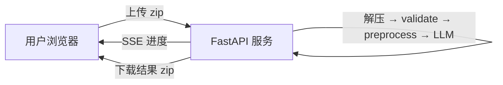

# `recorder_translate_server` 设计方案评审

> 评审模型：MiniMax-M3
> 评审时间：2026-06-06
> 评审对象：`recorder_translate_server/README.md`

## 一、整体设计概览



**核心定位**：把已有的 `record_translate` Python 包包成 Web 服务，让用户通过浏览器上传录制包即可翻译，免装 Python/命令行。

---

## 二、✅ 设计的优点

### 2.1 复用思路正确
直接 `import record_translate.workflow.run_workflow` 复用核心逻辑——**不重新发明轮子**。这是最大亮点，避免了 Python 与 Web 层出现翻译结果漂移。

### 2.2 技术选型务实
| 组件 | 选择 | 理由充分 |
|---|---|---|
| FastAPI | ✅ | 原生 async、OpenAPI 文档 |
| uvicorn | ✅ | FastAPI 标配 |
| python-multipart | ✅ | 文件上传必备 |
| zipfile（标准库）| ✅ | 不增加依赖 |
| 内存 dict | ✅ | 单机场景合理 |

### 2.3 SSE 比 WebSocket 更合适
进度推送是单向（服务端 → 浏览器），SSE 在 HTTP/1.1 就能用，断线自动重连，原生 EventSource API。**比 WebSocket 简单且足够**。

### 2.4 任务粒度清晰
`{job_id: status, progress, log, result_zip_path}` 这种 dict 状态对单机小规模够用。

---

## 三、⚠️ 主要问题与改进建议

### 🔴 关键问题

#### 问题 1：缺少"任务状态机"设计
目前只有 `status: queued` 状态，但实际翻译会经历：`queued → validating → preprocessing → phase1 → phase2 → phase4 → done | error`。

**风险**：前端只能显示"翻译中"或"完成"，无法做精细进度展示；一旦中间阶段失败，用户不知道卡在哪。

**建议**：
```python
class JobStatus(str, Enum):
    QUEUED = "queued"
    VALIDATING = "validating"
    PREPROCESSING = "preprocessing"
    PHASE1 = "phase1"
    PHASE2 = "phase2"
    PHASE4 = "phase4"
    COMPLETED = "completed"
    FAILED = "failed"

@dataclass
class Job:
    id: str
    status: JobStatus
    progress: float  # 0.0-1.0
    message: str
    error: str | None
    upload_path: Path
    result_zip_path: Path | None
    created_at: datetime
    updated_at: datetime
    sse_queue: asyncio.Queue  # 每个 job 一个独立队列
```

#### 问题 2：缺乏并发控制 / 资源隔离
当前设计允许多个用户同时上传并翻译。LLM 调用是 IO/CPU 密集且慢的：
- 多个 job 并发会同时打开多个 SSE 连接
- LLM API 通常有 QPS/RPM 限制（MiniMax、OpenAI 都有），并发会触发 429
- 大录制包（100+ actions × 3 phase × 多轮 = 几百次 LLM 调用）会拖垮服务

**建议**：
1. 用 `asyncio.Semaphore(N)` 限制同时翻译的 job 数（建议 N=2~3）
2. 排队显示：状态显示 `queued (前面还有 N 个)`
3. 每个 job 设置 `max_concurrent_llm_calls = 1` 内部串行
4. LLM 客户端加全局 token bucket / 滑动窗口限速

#### 问题 3：`uploads/{job_id}/` 无清理策略
解压到 `uploads/{job_id}/`，翻译完保留 zip：
- 单个录制 38 actions 约几 MB，但用户连续上传几天会累积 GB 级
- 失败/超时的 job 留下"僵尸"目录
- 没有 LRU 策略，也没有磁盘配额

**建议**：
```python
# 配置项
MAX_UPLOAD_SIZE_MB = 200
MAX_CONCURRENT_JOBS = 3
JOB_TTL_HOURS = 24
TOTAL_DISK_QUOTA_GB = 50

# 后台清理协程
async def janitor_loop():
    while True:
        await asyncio.sleep(300)  # 5 min
        await cleanup_expired_jobs()
        await enforce_disk_quota()
```

#### 问题 4：上传 zip 无大小/数量限制
`POST /api/upload` 接受 `file` 字段，但 README 未提：
- 单文件大小上限（防 OOM）
- 文件数量上限
- mime-type 校验（必须 application/zip）
- zip 内文件数限制（防 zip bomb：解压后 GB 级）

**建议**：
```python
@app.post("/api/upload", dependencies=[Depends(RateLimiter(times=5, seconds=60))])
async def upload(file: UploadFile = File(...), user=Depends(auth)):
    # 1. 检查 Content-Length
    # 2. 流式读取，限制字节数
    # 3. 校验 magic bytes（PK\x03\x04）
    # 4. zipfile 解压时限制总大小
    if file.size > MAX_UPLOAD_SIZE_MB * 1024 * 1024:
        raise HTTPException(413, "文件过大")
```

#### 问题 5：缺少身份认证 / 多租户隔离
任何人都能访问 `/api/upload` 翻译任意 zip，可能被滥用：
- 消耗 LLM API 配额（成本问题）
- 触发 429 影响其他人
- 拿不到结果但留下垃圾数据

**建议**（按场景选）：
- 内网/团队使用：HTTP Basic Auth + 共享密码
- 公网部署：必须加 OAuth/SSO + 速率限制
- 至少要有 API Key（`X-API-Key` 头）+ `slowapi` 速率限制

### 🟡 中等问题

#### 问题 6：SSE 队列设计有歧义
README 只说"SSE 实时进度"，但未说明：
- 是单 job 一个 SSE 连接，还是全局一个？
- 多个客户端订阅同一 job 怎么办（队列/广播）？
- SSE 断线后能恢复吗（"Last-Event-ID"）？

**建议**：
```python
class Job:
    subscribers: list[asyncio.Queue]  # 多客户端订阅同一 job
    
async def publish(job_id, event):
    for q in jobs[job_id].subscribers:
        await q.put(event)

@app.get("/api/jobs/{job_id}/stream")
async def stream(job_id: str, last_event_id: str | None = None):
    queue = asyncio.Queue()
    job.subscribers.append(queue)
    try:
        # 支持断线续传：重放 last_event_id 之后的事件
        async for event in event_stream(queue, last_event_id):
            yield event
    finally:
        job.subscribers.remove(queue)
```

#### 问题 7：解压路径无沙箱
`uploads/{job_id}/` 用 `job_id` 作为目录名，但 job_id 如果来自用户可控输入（`uuid` 是 OK 的，但若改为递增或用户传入），可能：
- `../../etc/passwd` 路径穿越
- 软链接攻击（zip 内有 `symlink → /etc/shadow`）

**建议**：
- job_id 强制用 `uuid4()` 服务端生成，不接受客户端传入
- 用 `zipfile.extractall(path, members=...)` 时过滤 `..`、绝对路径、符号链接
- 或直接用 `tempfile.mkdtemp()` 创建临时目录，job_id 仅作展示

#### 问题 8：翻译失败时未清理临时文件
README 没说错误时 `uploads/{job_id}/` 怎么处理。LLM 调用失败、文件损坏、OOM 都会留下半成品。

**建议**：在 `jobs.py` 中用 `try/finally` 包住 `run_workflow`，无论成功失败都清理解压目录（但保留 result zip 直到用户下载或 TTL 过期）。

#### 问题 9：缺少健康检查 / 探活端点
容器化部署时（如 Docker / k8s）需要：
- `GET /health` — 进程存活
- `GET /ready` — LLM API 可达 + 翻译模块加载完成

**建议**：
```python
@app.get("/health")
async def health():
    return {"status": "ok", "uptime": ...}

@app.get("/ready")
async def ready():
    try:
        await LLMClient.from_config().ping()
        return {"status": "ready"}
    except Exception as e:
        raise HTTPException(503, f"LLM 不可达: {e}")
```

#### 问题 10：API 缺少分页 / 列表过滤
`GET /api/jobs` 会无限增长，几周后返回几百条记录，前端要全部渲染。

**建议**：
- 支持 `?status=completed&limit=20&offset=0` 分页
- 文档说明默认返回最近 50 条

#### 问题 11：缺少结构化日志 / 指标
翻译一次调用几十次 LLM API，调试时需要：
- 每个 job 的耗时统计（preprocess / phase1 / phase2 / phase4 各多久）
- LLM 调用 QPS、错误率、token 消耗
- 当前只有 `logger`，没有 Prometheus/StatsD/OpenTelemetry 集成

**建议**：
- 用 `prometheus-fastapi-instrumentator` 自动加 metrics
- 自定义 counter：`llm_calls_total{phase, status}`、`job_duration_seconds{phase}`

### 🟢 小问题

#### 问题 12：单进程限制
FastAPI 单进程 + 内存 dict 无法横向扩展。若想跑多个 worker：
- 内存 dict 不可共享，需换成 Redis/SQLite
- SSE 长连接 worker 间路由复杂

README 既然说"单机场景不需要 Redis"，建议**显式注明不允许多 worker**，启动脚本用 `--workers 1`。

#### 问题 13：未说明 promp ts 加载方式
Python `record_translate/prompts/loader.py` 会从多个候选路径找 `config/prompts/*.md`。Web 服务需要把 prompts 跟 EXE 一起部署到 `config/prompts/`，README 未说明。

#### 问题 14：`run_dir` 临时目录的生命周期
`validate_recording(run_dir)` → `preprocess(run_dir, ...)` → `run_workflow(run_dir, ...)` 都需要 run_dir 持续存在。如果重启服务，临时目录丢失，但内存 dict 里的 job 记录还在 → 出现"幽灵 job"。

**建议**：job 状态持久化到 SQLite，重启后能恢复。

#### 问题 15：前端页面只有"上传 + 进度 + 下载"三块
README 说"用例预览"，但只渲染了 Markdown？建议明确：
- 仅显示 cases.md 文本（无需转换）
- 或用前端 markdown 库（marked.js 已 30KB）做渲染
- 若有截图，提供预览（cases.md 没图，但 phase1/structured_steps.json 也没图）

---

## 四、架构图改进建议

原方案：
```
用户浏览器
  │  上传录制 zip
  ▼
FastAPI 服务
  │  解压 → validate → preprocess → LLM
  │  SSE
  ▼
下载结果 zip
```

建议补充并发与状态维度：

```mermaid
graph TB
  subgraph Client[浏览器]
    UI[静态页面 index.html]
  end
  
  subgraph Server[FastAPI 单进程]
    LB[uvicorn]
    API[路由层]
    Q[Semaphore N=3]
    subgraph Workers[Worker 池 asyncio.Task]
      W1[job 1: 翻译中]
      W2[job 2: 翻译中]
      W3[job 3: 翻译中]
      WQ[job 4: 排队]
    end
    Store[内存 Jobs dict]
    Uploads[uploads/{uuid}/]
    Results[results/{uuid}.zip]
  end
  
  subgraph LLM
    API2[LLM Provider]
  end
  
  UI -->|upload zip| LB
  LB --> API
  API -->|acquire| Q
  Q --> W1 & W2 & W3
  Q -->|full| WQ
  W1 & W2 & W3 -->|run_workflow| API2
  W1 & W2 & W3 -->|SSE events| API
  API -->|stream| UI
  W1 & W2 & W3 -->|write zip| Results
  UI -->|download| Results
  API -->|cleanup| Uploads
```

---

## 五、API 设计补充建议

| 现有 | 问题 | 建议补充 |
|---|---|---|
| `POST /api/upload` | 无大小/类型限制 | 加 `Content-Length` 检查 + 速率限制 + auth |
| `GET /api/jobs/{id}` | 无 | 加 `?include=log` 参数返回完整日志 |
| `GET /api/jobs/{id}/stream` | 多客户端/断线恢复 | 加 `Last-Event-ID` 支持，加多客户端广播 |
| `GET /api/jobs/{id}/download` | 无过期时间 | 加 `?expires_at` 元数据 |
| `GET /api/jobs` | 无分页 | 加 `?limit/offset/status` |
| 缺 | 健康检查 | `GET /health`、`GET /ready` |
| 缺 | 主动取消 | `DELETE /api/jobs/{id}` |
| 缺 | 指标 | `GET /metrics` (Prometheus) |

---

## 六、部署/运维考量

README 没说：

1. **进程管理**：supervisor / systemd 怎么配置？
2. **反向代理**：nginx 该怎么转发？SSE 需要禁用缓冲（`proxy_buffering off`）
3. **HTTPS**：是否内置？Let’s Encrypt？
4. **Docker**：没有 Dockerfile，建议给一个
5. **配置管理**：除了 `ai.yaml`，端口/上传目录/限速/TTL 等怎么配置？环境变量？yaml？
6. **日志轮转**：uploads/ 目录清理 + 错误日志归档
7. **版本升级**：LLM 客户端或 workflow 升级后，正在翻译的 job 怎么办？建议启动时清理所有 `running` 状态为 `interrupted`

---

## 七、安全性矩阵

| 风险 | 严重性 | 设计是否覆盖 | 建议 |
|---|---|---|---|
| zip 路径穿越 | 高 | ❌ | job_id 用 uuid，过滤 `..` 和绝对路径 |
| zip bomb | 高 | ❌ | 限制解压总大小（≤500MB） |
| 任意文件上传 | 中 | ⚠️ 部分（依赖 zipfile 校验） | mime 校验 + magic bytes |
| API 滥用 / 配额耗尽 | 中 | ❌ | 加 auth + 速率限制 |
| 临时目录未清理导致磁盘占满 | 中 | ❌ | TTL + 磁盘配额 |
| LLM API Key 泄露 | 低 | ⚠️（config 文件权限） | 用 secret 管理（Vault / k8s secret） |
| 翻译结果泄露（其他用户） | 中 | ❌ | 每个 job 独立命名空间 + token 校验下载 |
| SSE 内存泄漏 | 中 | ⚠️（未说明断开清理） | `finally: subscribers.remove(queue)` |

---

## 八、整体评价与结论

### 8.1 评分

| 维度 | 评分 | 说明 |
|---|---|---|
| 整体架构 | ⭐⭐⭐⭐ | 复用思路正确，技术选型务实 |
| 任务管理设计 | ⭐⭐ | 缺状态机、缺并发控制、缺清理策略 |
| API 完整性 | ⭐⭐⭐ | 核心 API 都有，但缺认证/分页/取消/健康 |
| 安全性 | ⭐⭐ | 关键防护（zip 校验、auth、限速）都缺 |
| 可运维性 | ⭐⭐ | 缺指标/日志/部署/Docker/进程管理 |
| 文档清晰度 | ⭐⭐⭐⭐ | 简洁，结构清楚，但缺错误处理和边界条件 |

**总体**：⭐⭐⭐（3/5）—— **可开工，但必须先补 P0 安全和并发问题再写代码**。

### 8.2 行动建议

**立即做（写代码前）**：
1. 补"任务状态机"枚举（JobStatus）和 Job 数据类
2. 加 `asyncio.Semaphore(N=3)` 并发限制
3. 加 zip 大小/数量/magic-bytes 校验
4. 加 `uuid4` 服务端生成 job_id，路径沙箱
5. 加 auth（HTTP Basic + API Key 二选一）

**第一版 PR**：
6. TTL + 磁盘配额 + 清理协程
7. SSE 多客户端广播 + 断线恢复
8. 健康检查端点

**后续优化**：
9. Docker + 反向代理文档
10. Prometheus 指标
11. 持久化（如果未来要多 worker）

### 8.3 一句话总结

> 设计方向对、复用思路妙，但**目前只是一个能跑通 happy path 的最小骨架**，直接实现会让生产事故频发。建议先补 P0 五项（状态机/并发/校验/沙箱/auth）再开工，**预计多花 2~3 天但能避免上线后数周的故障排查**。
